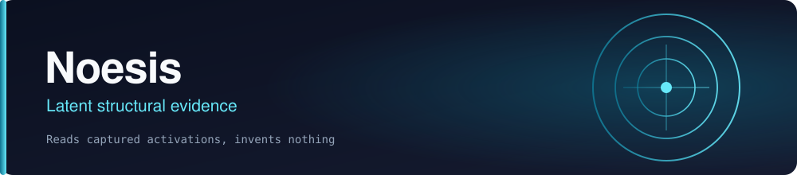

<p align="center"></p>

<p align="center">
  <a href="https://github.com/scrimshawlife-ctrl/Noesis/actions/workflows/runtime-validation.yml"></a>
  
  
  
</p>

# Noesis

Noesis is the Abraxas latent-representation research module: a contract-first system for measuring, comparing, falsifying, aligning, and settling claims about model representations without assuming those representations form a universal hidden language.

## Quickstart

```bash
python -m pip install -e ".[dev]"
python -m pytest tests/ -q          # 129 passed at last review
```

Noesis consumes latent captures supplied to it, so there is no model to download and no weights to fetch.

## Posture

- Canonical status: `CANON-SHADOW`
- Governance effect: `ADVISORY_ONLY`
- Runtime: `SLICE-001 + SLICE-002A + SLICE-003 + SLICE-004 + SLICE-005 + SLICE-006 + SLICE-007 + SLICE-008 + SLICE-009 + SLICE-010 + SLICE-011 + SLICE-012 + SLICE-013 + SLICE-014 + SLICE-015 + SLICE-016 + SLICE-017 + SLICE-018 + SLICE-019 + SLICE-020 + SLICE-021 + SLICE-022 + SLICE-023 + SLICE-024 + SLICE-025 + SLICE-026 + SLICE-027 IMPLEMENTED`
- Specification: `COMPLETE`
- N5 latent communication: `BLOCKED` pending AC-N4 + explicit operator authorization

## System boundary

```text
Hyperlexical        Noesis                  Abraxas
------------        ------                  -------
lexical forms  ->   latent evidence   ->    settlement/governance
slang               embeddings              SHADOW
symbols             hidden states           FORECAST
register            sparse features         canon decisions
transforms           probes/interventions
                    alignment/channels
```

Hyperlexical does not own latent truth. Noesis does not own Abraxas canon.

## Canonical specification

Read in this order:

1. `CONSTITUTION.md`
2. `specs/NOESIS-SYSTEM-SPEC.md`
3. `specs/REQUIREMENTS.md`
4. `specs/JOURNEYS.md`
5. `specs/WORKFLOWS.md`
6. `specs/STATE-MACHINES.md`
7. `specs/CONTRACTS.md`
8. `specs/DATA-MODEL.md`
9. `specs/SECURITY-GOVERNANCE.md`
10. `ARCHITECTURE.md`
11. `specs/ACCEPTANCE.md`
12. `TRACEABILITY.md`
13. `specs/TASKS.md`
14. `specs/VERIFICATION.md`
15. `docs/RESEARCH.md`
16. `STATUS.md` and `PLANS.md`

Experiments:
- `specs/EXP-001-SEMANTIC-INVARIANCE.md`
- `specs/EXP-001-GEOMETRY-PROFILE.md` (optional curvature-aware profile; no preferred geometry)
- `specs/EXP-002-LATENT-COMMUNICATION.md`

Machine-readable contracts live under `contracts/`.

## Provenance vocabulary

- `OBSERVED`: direct measured/recorded evidence.
- `INFERRED`: conclusion supported by evidence but not directly observed.
- `SPECULATIVE`: explicit hypothesis with insufficient confirming evidence.
- `NOT_COMPUTABLE`: required signal/evidence is missing or inadequate.

## Scientific guardrails

Noesis does **not** treat vector similarity, SAE feature labels, probe accuracy, steering success, latent task performance, or cross-model alignment as automatic evidence of consciousness, intent, semantic identity, universal neuralese, or a faithful hidden chain-of-thought transcript.

Negative evidence, failed captures, contradictory controls, and failed replications are first-class outputs.

## Current next gate

`EXP-001 INPUT FREEZE — OPERATOR APPROVAL REQUIRED`

AC-N0 and AC-N1 are accepted. The Hyperlex adapter and preregistration boundary are implemented. EXP-001 compilation requires an approval receipt bound to the exact corpus and transform/control catalog hashes. Noesis does not invent or self-approve those semantic inputs.

## Validation

Run:

```bash
python scripts/validate_specs.py
```

CI runs the same canonical specification validation on pull requests and pushes.

## Shared research program (candidate)

[Noesis participation in persistent-agent research](specs/PERSISTENT-AGENT-PROGRAM.md) maps this component into ABX-NOEMA-REP-001. Advisory specification only; existing contracts and gates remain authoritative.

## License

This repository is licensed under the MIT License. See [`LICENSE`](LICENSE). This matches `license = {text = "MIT"}` in `pyproject.toml`.

## Project status

- [ROADMAP.md](ROADMAP.md) — what is shipped, what is in progress, and what is deliberately not planned, each with its reason.
- [KANBAN.md](KANBAN.md) — the board, with every blocker named and evidenced.
- [CONTRIBUTING.md](CONTRIBUTING.md) — the working rules for this repository.
